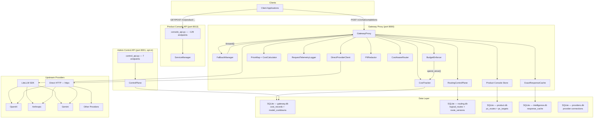
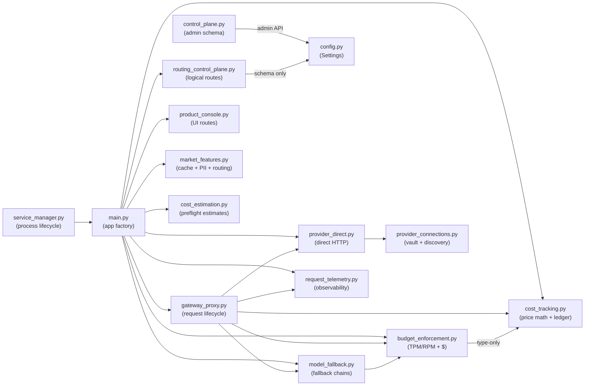
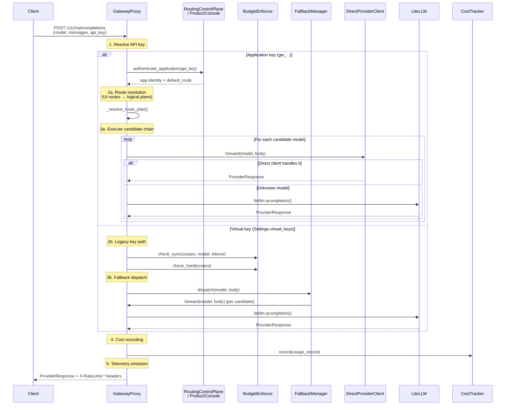
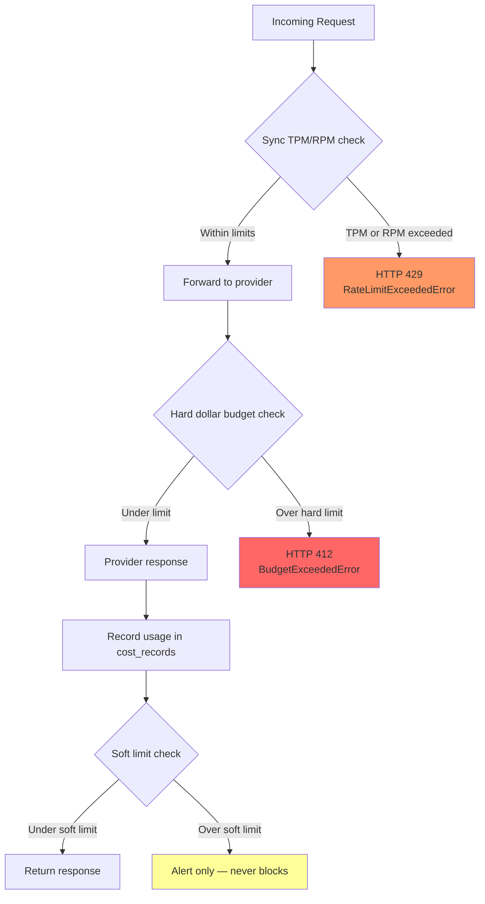

# Architecture

> **LLM Budget Gateway v14.2.0** — local-first, OpenAI-compatible AI gateway
> with budget enforcement, logical routing, provider discovery, trace analytics,
> governance, and a React product cockpit UI.

## Overview

The LLM Budget Gateway sits between client applications and upstream LLM
providers (OpenAI, Anthropic, Gemini, etc.). It intercepts every
`/v1/chat/completions`, `/v1/completions`, and `/v1/embeddings` request to
enforce budgets, apply fallback routing, track costs, and emit telemetry — all
while remaining wire-compatible with the OpenAI API.

The system has **two runtime modes**:

| Mode | Entry point | What runs |
|------|-------------|-----------|
| **Single-process (gateway-system)** | `uv run gateway-system --no-browser` | Gateway proxy (port 8000) + Product Console API (port 8013) in one process, managed by `ServiceManager` |
| **Gateway-only** | `uv run uvicorn llm_budget_gateway.main:create_app --factory` | Just the gateway proxy (port 8000); cockpit UI accessed separately |

A legacy **split mode** runs optional satellite services (intelligence,
operations, quality, security) on separate ports (8002–8005), enabled by
`GATEWAY_ENABLE_SATELLITES=1`. These have been folded into the cockpit product
API by default.

---

## System Architecture

### Mermaid Component Diagram



### Module Dependency Graph

The import direction is **acyclic** — no circular dependencies:



**Key rule:** `budget_enforcement → cost_tracking` is type-only (uses
`BudgetScope` defined in `budget_enforcement`; `cost_tracking` imports it). No
reverse import.

---

## Request Flow

### Chat Completion Request Flow



### Console API Request Flow

The Product Console API (`console_api.py`, ~129 endpoints on port 8013) serves
the React cockpit UI. It manages:

1. **Applications & Routes** — CRUD with versioned publish/rollback
2. **Provider Connections** — encrypted key storage, model discovery, health
3. **Customers & Usage** — budget management, daily spend, model breakdown
4. **Safety & Governance** — runaway cost firewall, policy governor, releases
5. **Observability** — traces, evidence spans, replay, incident events
6. **Intelligence** — PII redaction, exact-response cache, cost-aware routing
7. **Prompts & Quality** — prompt versioning, SLO monitoring, audit trails
8. **Alerts, Keys, Budgets** — key rotation, budget management, alert CRUD

Each endpoint authenticates via application keys and delegates to
`RoutingControlPlane`, `ControlPlane`, or domain-specific stores.

### Budget Enforcement Flow



**Three enforcement layers:**

1. **Sync TPM/RPM ceilings** (`check_sync`) — increments windowed counters per
   scope; rejects with 429 when the ceiling is hit. Counter windows are
   bucketed by `budget_window_seconds()` (supports `30s`, `30m`, `30h`, `30d`,
   `daily`, `monthly`).

2. **Async hard dollar budgets** (`check_hard`) — queries the cost ledger for
   spend within the window; rejects with 412 when `spent >= hard_limit`.

3. **Soft dollar alerts** (`soft_exceeded`) — returns exceeded scopes without
   blocking. Used by the alerts system to fire notifications.

---

## Core Components

### GatewayProxy

**Module:** `gateway_proxy.py` (2,428 lines)

**Purpose:** Owns the full request lifecycle — auth → scopes → budget
enforcement → forwarding → cost recording.

**Key methods:**
- `handle_chat_completion(body, api_key, headers)` — main entry for POST /v1/chat/completions
- `handle_completion(body, api_key, headers)` — POST /v1/completions
- `handle_embeddings(body, api_key, headers)` — POST /v1/embeddings
- `_handle(body, api_key, headers)` — shared lifecycle: tries logical routes first, falls back to legacy key path
- `_handle_logical_route(body, api_key, headers, request_id)` — resolves route via UI or logical plane, runs candidate chain
- `forward(model, body)` — single model forward (litellm or direct client)
- `resolve_scopes(api_key, headers)` — maps API key to `BudgetScope` list

**Data flow:**
1. Authenticate via RoutingControlPlane (app keys) or Settings.virtual_keys
2. For app keys: resolve route → get candidate models → execute chain
3. For virtual keys: check_sync (TPM/RPM) → check_hard ($) → forward_with_fallback
4. Record usage, emit telemetry, attach rate-limit headers

**Attachable modules** (set via `attach_*` methods, wired in `create_app()`):
- `attach_routing_control_plane(plane)` — logical route resolution
- `attach_product_console(store)` — UI-managed routes
- `attach_direct_client(client)` — direct HTTP transport (replaces litellm)
- `attach_intelligence(cache, redactor, cost_router)` — PII, cache, cost-aware routing
- `attach_telemetry(logger)` — LLM request telemetry

### FallbackManager

**Module:** `model_fallback.py` (189 lines)

**Purpose:** Typed fallback chains with error classification, cooldowns, and
context pre-checks.

**Key methods:**
- `chain_for(model)` — returns `[model] + chain` filtered by cooldown
- `classify_error(exc, status_code)` — maps exceptions to trigger classes (`rate_limit`, `timeout`, `server_error`, `content_policy`, `context_window`, `unknown`)
- `should_fallback(config, error_class)` — checks if the error is in the config's trigger list
- `dispatch(proxy, model, body, ...)` — walks the chain, returns first success
- `context_safe(model, body)` — pre-call check: estimated tokens ≤ model context budget
- `mark_failed(model)` / `in_cooldown(model)` — stampede protection

**Error classification → trigger mapping:**
| Error class | HTTP status | Trigger |
|-------------|-------------|---------|
| `rate_limit` | 429 | `rate_limit` |
| `timeout` | — | `timeout` |
| `server_error` | 5xx | `server_error` |
| `content_policy` | — | `content_policy` |
| `context_window` | 400 (context) | `context_window` |

### BudgetEnforcer

**Module:** `budget_enforcement.py` (322 lines)

**Purpose:** Sync pre-dispatch TPM/RPM ceilings + async post-response dollar
budgets. Hierarchical scopes: global > team > user > key.

**Key classes:**
- `BudgetScope(kind, key)` — immutable scope identifier (`"global:default"`, `"key:gw_abc"`)
- `BudgetConfig(scope, soft_limit, hard_limit, window, tpm_limit, rpm_limit)` — per-scope budget configuration
- `InMemoryCounterStore` — thread-safe LRU-bounded windowed counters (10k bucket cap)

**Key methods:**
- `check_sync(scopes, model, est_input_tokens)` — increments TPM/RPM counters; raises `RateLimitExceededError` on ceiling hit
- `check_hard(scopes)` — queries ledger; raises `BudgetExceededError` on hard limit
- `soft_exceeded(scopes)` — returns scopes past soft limit (never raises)
- `config_for(scope)` — matches scope to its BudgetConfig

**Scope hierarchy:** Global budgets roll up — a request with `key:gw_abc` also
checks `user:42`, `team:eng`, and `global:default` scopes (most restrictive wins).

### ControlPlane

**Module:** `control_plane.py` (463 lines)

**Purpose:** Tenant-isolated SQLite control plane for keys, budgets, policy,
observability, alerts, and routes. Every query is tenant-scoped.

**Key methods:**
- `issue_key(tenant, role, label, models)` — issue virtual API key (SHA-256 hash stored)
- `authenticate(secret)` — hash lookup, expiry check, status check
- `set_budget(tenant, role, scope, limit_value)` — set dollar budget
- `reserve(tenant, key_id, request_id, amount)` — pre-flight reservation (BEGIN IMMEDIATE)
- `reconcile(rid, actual)` — post-response reconciliation
- `evaluate_alerts(tenant, dispatch)` — evaluate alert rules against spend ratio
- `put_policy / evaluate_policy` — model/region/content policy enforcement

### RoutingControlPlane

**Module:** `routing_control_plane.py` (516 lines)

**Purpose:** Application-facing logical routes with versioned, explainable
model selection. Routes have draft/published versions with immutable history.

**Key methods:**
- `create_application(name, default_route)` — creates app with SHA-256-hashed API key
- `authenticate_application(api_key)` — hash-based authentication
- `create_route(config)` — creates version 1 as a draft
- `update_route(route_id, config)` — creates new immutable draft version
- `publish_route(route_id)` — atomically makes draft the active production version
- `rollback_route(route_id)` — rolls back to previous published version
- `simulate(route_id, ...)` — full model selection with explainable decision path
- `resolve_alias(name, ...)` — resolve a published logical alias using persisted spend and health
- `record_model_spend / model_spend` — per-model monthly spend tracking
- `set_model_health / model_health` — provider health eligibility

**Model selection gates (in order):** application → schedule → window → budget
→ health → model selection

### CostTracker

**Module:** `cost_tracking.py` (1,058 lines)

**Purpose:** Token × price math and SQLite (WAL) ledger. Three layers:
`PriceMap` → `CostCalculator` → `CostStore`.

**Key classes:**
- `PriceMap` — litellm.model_cost baseline + manual overrides
- `CostCalculator` — pure function: `tokens × price / 1e6`
- `CostStore` — SQLite ledger with thread-safe access
- `CostTracker` — async facade combining calculator + store

**Key methods:**
- `CostStore.insert(record)` — persist one usage record
- `CostStore.spend_since(scope_key, since_epoch)` — sum total_cost for a scope within a time window
- `CostStore.daily_usage(days, route)` — aggregate per-day per-model usage
- `CostStore.set_model_cooldown(route, model, seconds, reason)` — route-scoped cooldown with dynamic ladder escalation
- `CostStore.record_success(route, model)` — resets cooldown strikes to zero

**Dynamic cooldown ladder:** Each failure increments a strike count; cooldown
duration follows `[60s, 300s, 900s, 3600s, 7200s, 14400s, 28800s, 43200s,
64800s, 86400s]` (1 min → 1 day). A successful call resets strikes to zero.

### ProviderConnections

**Module:** `provider_connections.py` (1,108 lines)

**Purpose:** Secure named provider connections with provider-native model
discovery. API keys encrypted with AES-GCM via a local master key.

**Key classes:**
- `CredentialVault` — AES-GCM encryption/decryption of API keys
- `ProviderConnectionStore` — SQLite-backed CRUD for provider connections

**Supported providers:** OpenAI, Anthropic, Google Gemini, Azure OpenAI, AWS
Bedrock, plus custom OpenAI-compatible endpoints. Each provider has a
`discovery` adapter that queries the provider's model list API.

**Security:** API keys are never stored in plaintext. The master key
(`provider-master.key`) is a 32-byte random file. Keys are encrypted with
AES-256-GCM per connection.

### DirectProviderClient

**Module:** `provider_direct.py` (961 lines)

**Purpose:** Direct OpenAI-compatible provider transport (no litellm
dependency). Resolves a requested model to a configured provider endpoint and
forwards as plain HTTP calls via httpx.

**Auth modes:** `bearer` (default), `x-api-key` (Anthropic-style),
`query` (Gemini-style).

**Key methods:**
- `forward(model, body)` — HTTP POST to provider endpoint
- `stream(model, body)` — streaming SSE forward

### ServiceManager

**Module:** `service_manager.py` (361 lines)

**Purpose:** Local development process manager for gateway FastAPI services.
Starts/stops uvicorn workers, manages log files, detects port conflicts.

**Default services (single-process mode):**
| Slug | Service | Port | Factory |
|------|---------|------|---------|
| `gateway` | Gateway | 8000 | `llm_budget_gateway.main:create_app` |
| `cockpit` | Product Console | 8013 | `llm_budget_gateway.console_api:create_console_app` |

**Legacy satellite services** (opt-in via `GATEWAY_ENABLE_SATELLITES=1`):
Control Center (8001), Intelligence (8002), Operations (8003), Quality (8004),
Security (8005).

---

## Data Layer

### ControlPlane Database Schema

Stored in `gateway.db` (shared with cost_records). Created by
`ControlPlane.__init__()`.

```sql
-- Workspace configuration (one per tenant)
CREATE TABLE IF NOT EXISTS workspaces(
    tenant TEXT PRIMARY KEY,
    name TEXT NOT NULL,
    version INTEGER NOT NULL DEFAULT 1
);

-- Idempotency cache for duplicate-safe API calls
CREATE TABLE IF NOT EXISTS idem(
    tenant TEXT NOT NULL,
    k TEXT NOT NULL,
    response TEXT NOT NULL,
    PRIMARY KEY(tenant, k)
);

-- Virtual API keys (SHA-256 hash, never plaintext)
CREATE TABLE IF NOT EXISTS keys(
    id TEXT PRIMARY KEY,
    tenant TEXT NOT NULL,
    label TEXT NOT NULL,
    secret_hash TEXT NOT NULL UNIQUE,
    models TEXT NOT NULL,           -- JSON array of allowed model names
    status TEXT NOT NULL,           -- 'active' | 'revoked'
    expires INTEGER,                -- epoch expiry (NULL = never)
    overlap_until INTEGER,          -- rotation overlap window
    created INTEGER NOT NULL
);

-- Dollar budgets per scope
CREATE TABLE IF NOT EXISTS budgets(
    tenant TEXT NOT NULL,
    scope TEXT NOT NULL,            -- 'global' | 'team:X' | 'user:Y' | 'key:Z'
    limit_value REAL NOT NULL,
    spent REAL NOT NULL DEFAULT 0,
    PRIMARY KEY(tenant, scope)
);

-- Pre-flight reservations (BEGIN IMMEDIATE transactions)
CREATE TABLE IF NOT EXISTS reservations(
    id TEXT PRIMARY KEY,
    tenant TEXT NOT NULL,
    scope TEXT NOT NULL,
    request_id TEXT NOT NULL UNIQUE,
    amount REAL NOT NULL,           -- estimated cost
    actual REAL,                    -- actual cost after reconciliation
    state TEXT NOT NULL,            -- 'reserved' | 'reconciled'
    created INTEGER NOT NULL,
    model TEXT,
    latency_ms INTEGER
);

-- Alert rules (spend ratio thresholds)
CREATE TABLE IF NOT EXISTS alerts(
    id TEXT PRIMARY KEY,
    tenant TEXT NOT NULL,
    name TEXT NOT NULL,
    threshold REAL NOT NULL,        -- ratio (e.g. 0.8 = 80%)
    channel TEXT NOT NULL,          -- dispatch target
    state TEXT NOT NULL DEFAULT 'ready'  -- 'ready' | 'triggered'
);

-- Governance policies (model/region/content rules)
CREATE TABLE IF NOT EXISTS policies(
    id TEXT PRIMARY KEY,
    tenant TEXT NOT NULL,
    name TEXT NOT NULL,
    rules TEXT NOT NULL,            -- JSON: {allowed_models, regions, blocked_terms}
    active INTEGER NOT NULL DEFAULT 1
);

-- Policy decision audit log
CREATE TABLE IF NOT EXISTS decisions(
    id TEXT PRIMARY KEY,
    tenant TEXT NOT NULL,
    model TEXT NOT NULL,
    region TEXT NOT NULL,
    allowed INTEGER NOT NULL,       -- 0 | 1
    code TEXT NOT NULL,             -- 'allowed' | 'model_denied' | 'region_denied' | 'blocked_content'
    created INTEGER NOT NULL
);

-- Legacy route deployments (circuit breaker)
CREATE TABLE IF NOT EXISTS routes(
    tenant TEXT NOT NULL,
    name TEXT NOT NULL,
    deployments TEXT NOT NULL,      -- JSON array of deployment configs
    cache_ttl INTEGER NOT NULL,
    PRIMARY KEY(tenant, name)
);

-- Circuit breaker health tracking
CREATE TABLE IF NOT EXISTS health(
    tenant TEXT NOT NULL,
    route TEXT NOT NULL,
    deployment TEXT NOT NULL,
    failures INTEGER NOT NULL DEFAULT 0,
    open_until INTEGER NOT NULL DEFAULT 0,  -- epoch when circuit closes
    PRIMARY KEY(tenant, route, deployment)
);

-- Response cache (route-level TTL)
CREATE TABLE IF NOT EXISTS cache(
    tenant TEXT NOT NULL,
    route TEXT NOT NULL,
    k TEXT NOT NULL,
    value TEXT NOT NULL,
    expires INTEGER NOT NULL,
    PRIMARY KEY(tenant, route, k)
);

-- Audit trail
CREATE TABLE IF NOT EXISTS audit(
    id TEXT PRIMARY KEY,
    tenant TEXT NOT NULL,
    actor TEXT NOT NULL,
    action TEXT NOT NULL,           -- e.g. 'key.issue', 'budget.set', 'route.put'
    object_id TEXT NOT NULL,
    created INTEGER NOT NULL
);
```

### RoutingControlPlane Database Schema

Stored in `routing.db`. Created by `RoutingControlPlane.__init__()`.

```sql
-- Application registry (API keys for logical routing)
CREATE TABLE IF NOT EXISTS gateway_applications(
    id TEXT PRIMARY KEY,            -- 'app_<hex>'
    name TEXT NOT NULL,
    default_route TEXT NOT NULL,
    api_key_hash TEXT NOT NULL,     -- SHA-256 hash of gw_... key
    created_at TEXT NOT NULL
);

-- Logical routes (versioned, explainable model selection)
CREATE TABLE IF NOT EXISTS logical_routes(
    id TEXT PRIMARY KEY,            -- 'route_<hex>'
    name TEXT UNIQUE NOT NULL,      -- human-readable alias (e.g. "hermes-default")
    draft_version INTEGER NOT NULL,
    published_version INTEGER,      -- NULL until first publish
    status TEXT NOT NULL            -- 'draft' | 'active'
);

-- Immutable route configuration versions
CREATE TABLE IF NOT EXISTS route_versions(
    route_id TEXT NOT NULL,
    version INTEGER NOT NULL,
    config_json TEXT NOT NULL,      -- full route config (JSON)
    created_at TEXT NOT NULL,
    PRIMARY KEY(route_id, version)
);

-- Explainable model selection decisions (audit trail)
CREATE TABLE IF NOT EXISTS route_activity(
    decision_id TEXT PRIMARY KEY,   -- 'dec_<hex>'
    route_id TEXT NOT NULL,
    version INTEGER NOT NULL,
    selected_model TEXT NOT NULL,
    fallback_reason TEXT,           -- 'budget' | 'health' | 'window' | 'fallback' | NULL
    decision_json TEXT NOT NULL,    -- full decision path with gate results
    created_at TEXT NOT NULL
);

-- Per-model monthly spend attribution
CREATE TABLE IF NOT EXISTS route_model_spend(
    route_name TEXT NOT NULL,
    model TEXT NOT NULL,
    period TEXT NOT NULL,           -- 'YYYY-MM'
    spend REAL NOT NULL,
    PRIMARY KEY(route_name, model, period)
);

-- Per-model health status
CREATE TABLE IF NOT EXISTS route_model_health(
    route_name TEXT NOT NULL,
    model TEXT NOT NULL,
    healthy INTEGER NOT NULL,       -- 0 | 1
    updated_at TEXT NOT NULL,
    PRIMARY KEY(route_name, model)
);
```

### Cost Tracking Schema

Stored in `gateway.db`. Created by `CostStore.__init__()`.

```sql
-- Per-request cost ledger (WAL mode)
CREATE TABLE IF NOT EXISTS cost_records (
    request_id TEXT PRIMARY KEY,
    api_key TEXT NOT NULL,
    user_id TEXT,
    team TEXT,
    model TEXT NOT NULL,
    provider TEXT NOT NULL,
    prompt_tokens INTEGER NOT NULL,
    completion_tokens INTEGER NOT NULL,
    total_tokens INTEGER NOT NULL,
    reasoning_tokens INTEGER NOT NULL DEFAULT 0,
    input_cost REAL NOT NULL,
    output_cost REAL NOT NULL,
    reasoning_cost REAL NOT NULL DEFAULT 0.0,
    total_cost REAL NOT NULL,
    latency_ms INTEGER NOT NULL,
    status TEXT NOT NULL,           -- 'success' | 'error' | 'fallback' | 'timeout'
    status_code INTEGER,
    timestamp INTEGER NOT NULL,
    tool_name TEXT,                 -- e.g. "server_id:tool_name" for MCP calls
    project TEXT,
    route TEXT,                     -- logical route name
    client_id TEXT,
    client_profile TEXT,
    cache_hit INTEGER NOT NULL DEFAULT 0,
    conversation_id TEXT,
    customer_id TEXT
);

-- Indexes
CREATE INDEX IF NOT EXISTS idx_cost_records_timestamp
    ON cost_records (timestamp);
CREATE INDEX IF NOT EXISTS idx_cost_records_api_key_timestamp
    ON cost_records (api_key, timestamp);
CREATE INDEX IF NOT EXISTS idx_cost_records_customer_timestamp
    ON cost_records (customer_id, timestamp);

-- Route-scoped model cooldowns (dynamic escalation ladder)
CREATE TABLE IF NOT EXISTS model_cooldowns (
    route TEXT NOT NULL,
    model TEXT NOT NULL,
    until_ts INTEGER NOT NULL,
    reason TEXT,
    strikes INTEGER NOT NULL DEFAULT 0,
    PRIMARY KEY (route, model)
);

-- LLM request telemetry
CREATE TABLE IF NOT EXISTS telemetry_requests (
    request_id TEXT PRIMARY KEY,
    trace_id TEXT NOT NULL,
    provider TEXT NOT NULL,         -- 'litellm' | 'direct' | 'unknown'
    model TEXT NOT NULL,
    api_key TEXT,
    user_id TEXT,
    team TEXT,
    customer_id TEXT,
    route TEXT,
    prompt_tokens INTEGER NOT NULL DEFAULT 0,
    completion_tokens INTEGER NOT NULL DEFAULT 0,
    total_tokens INTEGER NOT NULL DEFAULT 0,
    reasoning_tokens INTEGER NOT NULL DEFAULT 0,
    input_cost REAL NOT NULL DEFAULT 0.0,
    output_cost REAL NOT NULL DEFAULT 0.0,
    reasoning_cost REAL NOT NULL DEFAULT 0.0,
    total_cost REAL NOT NULL DEFAULT 0.0,
    latency_ms INTEGER NOT NULL,
    status TEXT NOT NULL,
    status_code INTEGER,
    conversation_id TEXT,
    metadata_json TEXT,
    recorded_at INTEGER NOT NULL
);
```

### Response Cache Schema

Stored in `intelligence.db`. Created by `ExactResponseCache.__init__()`.

```sql
-- Exact-response cache (tenant-isolated, deterministic keys)
CREATE TABLE IF NOT EXISTS response_cache(
    tenant TEXT NOT NULL,
    key_hash TEXT NOT NULL,         -- SHA-256 of canonical request
    value TEXT NOT NULL,            -- cached response body
    created_at INTEGER NOT NULL,
    expires_at INTEGER NOT NULL,
    PRIMARY KEY(tenant, key_hash)
);
```

---

## Deployment Architecture

### Single-Process Mode (gateway-system)

The default deployment. `ServiceManager` starts two uvicorn workers in the
same process:

```
┌─────────────────────────────────────────────────────┐
│                gateway-system process                 │
│                                                      │
│  ┌──────────────────┐  ┌──────────────────────────┐ │
│  │ Gateway Proxy     │  │ Product Console API       │ │
│  │ :8000             │  │ :8013                     │ │
│  │ main.py           │  │ console_api.py            │ │
│  └──────────────────┘  └──────────────────────────┘ │
│                                                      │
│  Shared data dir: .gateway-console/                  │
│  ├── gateway.db   (cost_records, model_cooldowns)    │
│  ├── routing.db   (logical_routes, applications)     │
│  ├── product.db   (UI-managed routes, targets)       │
│  ├── intelligence.db (response_cache)                │
│  ├── providers.db (provider connections)             │
│  └── provider-master.key (AES-GCM vault key)         │
└─────────────────────────────────────────────────────┘
```

### Split Mode (proxy + cockpit)

For production deployments where the proxy and console run on separate hosts:

```bash
# Proxy node
uv run uvicorn llm_budget_gateway.main:create_app --factory --host 0.0.0.0 --port 8000

# Console node
uv run uvicorn llm_budget_gateway.console_api:create_console_app --factory --host 0.0.0.0 --port 8013
```

Both nodes share the same SQLite database directory (NFS, bind mount, or
separate DB per node with replication).

### Legacy Satellite Services (opt-in)

Enabled by `GATEWAY_ENABLE_SATELLITES=1`:

| Port | Service | Factory |
|------|---------|---------|
| 8000 | Gateway | `main:create_app` |
| 8001 | Control Center | `control_api:create_control_app` |
| 8002 | Intelligence | `market_api:create_market_app` |
| 8003 | Operations | `operations_api:create_operations_app` |
| 8004 | Quality | `evaluation_api:create_evaluation_app` |
| 8005 | Security | `security_api:create_security_app` |

These services' capabilities have been folded into the cockpit product API;
the satellite services are retained for backward compatibility only.

---

## Security Model

### Tenant Isolation

Every query in `ControlPlane` is tenant-scoped. The tenant ID is derived from
the authenticated API key (via the `keys` table lookup). There is no
cross-tenant data leakage: all `SELECT`, `INSERT`, and `UPDATE` statements
include `WHERE tenant=?` or equivalent scoping.

`RoutingControlPlane` uses application-scoped isolation: each application has
its own key and routes are looked up by name (globally unique, enforced by
`UNIQUE` constraint on `logical_routes.name`).

### Role-Based Access Control (RBAC)

Five roles with strict ordering:

| Role | Level | Capabilities |
|------|-------|-------------|
| `viewer` | 0 | Read-only dashboard, export spend CSV |
| `auditor` | 1 | List keys, view audit events, policy decisions |
| `operator` | 2 | Create alerts, manage routes |
| `security` | 3 | Put policies, evaluate policy rules |
| `admin` | 4 | Issue/revoke keys, set budgets, configure workspace |

Every `ControlPlane` method calls `self._require(role, minimum_role)` which
compares numeric levels. Permission denied raises `PermissionDenied`.

### API Key Management (Hash-Based)

API keys are never stored in plaintext:

1. **Generation:** `"gw_" + secrets.token_urlsafe(24)` — URL-safe, 32-char random token
2. **Storage:** `hashlib.sha256(secret.encode()).hexdigest()` in the `keys.secret_hash` column
3. **Authentication:** Client sends key → SHA-256 hash → lookup in DB → check status + expiry
4. **Rotation:** `rotate_key()` issues a new key while setting `overlap_until` on the old key
5. **Revocation:** `revoke_key()` sets `status='revoked'` — immediate rejection

Application keys (in `RoutingControlPlane`) follow the same hash-based pattern
via `gateway_applications.api_key_hash`.

### PII Redaction

The `PIIRedactor` class (in `market_features.py`) applies regex-based
redaction to outbound request bodies:

| Pattern | Detection | Replacement |
|---------|-----------|-------------|
| Email addresses | `\b[\w.+-]+@[\w-]+(?:\.[\w-]+)+\b` | `[REDACTED_EMAIL]` |
| Credit card numbers | `(?<!\d)(?:\d[ -]*?){13,19}(?!\d)` | `[REDACTED_CARD]` |
| Phone numbers | `(?<!\d)(?:\+?\d[\d .()-]{7,}\d)(?!\d)` | `[REDACTED_PHONE]` |

Redaction is opt-in per request via `X-Gateway-Redact-Pii: 1` header or
`metadata.redact_pii: true`. The redacted text is forwarded to the provider;
the original is never sent.

### Additional Security Measures

- **Forward allow-list:** Client bodies are filtered by `_FORWARD_ALLOWLIST`
  — provider credentials, endpoint overrides, and base URLs are never accepted
  from the client body (SSRF + cost-bypass prevention).
- **Budget reservation transactions:** `BEGIN IMMEDIATE` with
  `ROLLBACK` on failure prevents double-spend race conditions.
- **Audit trail:** Every mutation in `ControlPlane` writes to the `audit` table
  with actor, action, object_id, and timestamp.
- **Circuit breakers:** 3 consecutive failures open a 60-second circuit on a
  deployment; success resets to closed.

---

## Module Map

| Module | Lines | Responsibility |
|--------|-------|---------------|
| `gateway_proxy.py` | 2,428 | Request lifecycle: auth → scopes → enforce → forward → cost record |
| `console_api.py` | 1,853 | Product Console API (~129 endpoints for the React cockpit) |
| `cost_tracking.py` | 1,058 | Token × price math, SQLite WAL ledger, daily/monthly aggregations |
| `provider_direct.py` | 961 | Direct HTTP transport to providers (no litellm) |
| `provider_connections.py` | 1,108 | Encrypted provider key vault, model discovery |
| `routing_control_plane.py` | 516 | Versioned logical routes with explainable model selection |
| `control_plane.py` | 463 | Tenant-isolated admin schema: keys, budgets, policies, alerts |
| `main.py` | 560 | `create_app()` factory: wires all components, mounts gateway routes |
| `request_telemetry.py` | 439 | LLM request telemetry (observability MVP) |
| `budget_enforcement.py` | 322 | Sync TPM/RPM ceilings, async dollar budgets, YAML loader |
| `model_fallback.py` | 189 | Typed fallback chains, error classification, cooldowns |
| `market_features.py` | 225 | PII redaction, exact-response cache, cost-aware routing |
| `service_manager.py` | 361 | Process manager for uvicorn workers |
| `config.py` | — | `Settings` (pydantic-settings v2, `GATEWAY_*` env vars) |
| `cost_estimation.py` | — | Preflight cost estimation |
| `product_console.py` | — | UI-managed route store (pc_routes/targets model) |
| `cost_attribution.py` | — | Per-tool and per-project cost attribution |
